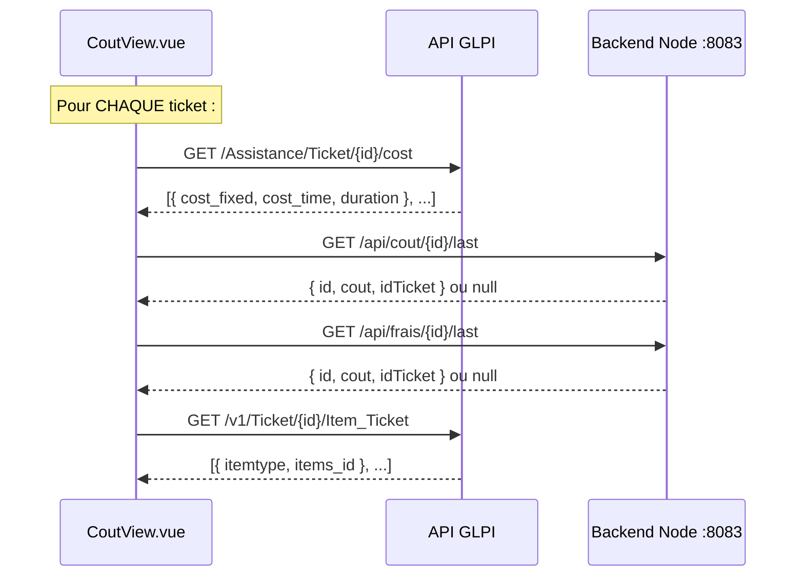
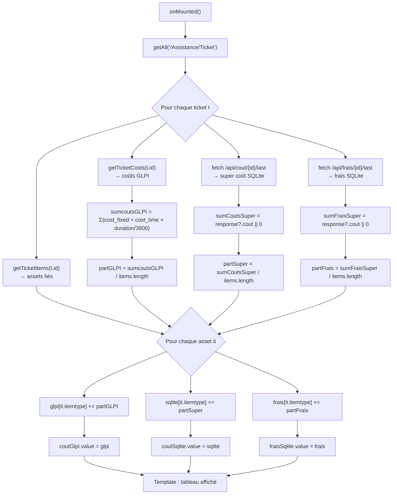

# Documentation — CoutView.vue

> Vue backoffice qui affiche un **tableau récapitulatif des coûts par catégorie d'asset** (Computer, Monitor, Phone), en croisant 3 sources de données.

---

## Table des matières

1. [Vue d'ensemble](#1-vue-densemble)
2. [Sources de données](#2-sources-de-données)
3. [Algorithme de calcul](#3-algorithme-de-calcul)
4. [Appels API effectués](#4-appels-api-effectués)
5. [Structure du template](#5-structure-du-template)
6. [Formules de calcul](#6-formules-de-calcul)
7. [Flux de données complet](#7-flux-de-données-complet)
8. [Bug connu](#8-bug-connu)

---

## 1. Vue d'ensemble

**Fichier** : [CoutView.vue](file:///c:/xampp/htdocs/S6/Eval2/GLPI_NewApp/src/views/backoffice/CoutView.vue)

**But** : Afficher un tableau qui ventile les coûts **par catégorie d'asset** (Computer, Monitor, Phone) selon 3 colonnes :

| Colonne | Source | Description |
|---|---|---|
| **Cout GLPI** | API GLPI v2 | Coûts enregistrés nativement dans GLPI (cost_fixed + cost_time × duration) |
| **Super Cout** | Backend Node (SQLite) | Coût personnalisé saisi lors de la clôture d'un ticket |
| **Frais de réouverture** | Backend Node (SQLite) | Frais calculé en % du dernier coût lors de la réouverture |

### Rendu visuel

```
┌───────────────┬────────────┬────────────┬─────────────────────┐
│  Categorie    │ Cout GLPI  │ Super Cout │ Frais de reouverture│
├───────────────┼────────────┼────────────┼─────────────────────┤
│  Computer     │   450.00   │   800.00   │        50.00        │
│  Monitor      │   120.00   │   200.00   │         0.00        │
│  Phone        │    80.00   │   150.00   │        15.00        │
└───────────────┴────────────┴────────────┴─────────────────────┘
```

---

## 2. Sources de données

### 3 refs réactives

```js
const coutGlpi    = ref([])   // { Computer: 450, Monitor: 120, Phone: 80 }
const coutSqlite  = ref([])   // { Computer: 800, Monitor: 200, Phone: 150 }
const fraisSqlite = ref([])   // { Computer: 50,  Monitor: 0,   Phone: 15 }
```

> [!NOTE]
> Les refs sont initialisées comme `[]` mais contiennent en réalité des **objets** `{}` après le `onMounted`. Elles sont utilisées comme des dictionnaires `{ itemtype: somme }`.

### APIs sollicitées

| API | Endpoint | Données récupérées |
|---|---|---|
| **GLPI v2** | `GET /Assistance/Ticket` | Liste de tous les tickets |
| **GLPI v2** | `GET /Assistance/Ticket/{id}/cost` | Coûts GLPI d'un ticket |
| **GLPI v1** | `GET /v1/Ticket/{id}/Item_Ticket` | Assets liés à un ticket |
| **Node** | `GET /api/cout/{idTicket}/last` | Dernier super coût d'un ticket |
| **Node** | `GET /api/frais/{idTicket}/last` | Dernier frais de réouverture d'un ticket |

---

## 3. Algorithme de calcul

### Logique étape par étape

Pour **chaque ticket** dans GLPI :

```
┌─────────────────────────────────────────────────────────────┐
│  ÉTAPE 1 : Récupérer les coûts GLPI du ticket              │
│  GET /Assistance/Ticket/{id}/cost                           │
│  → Calculer la somme : cost_fixed + (cost_time × duration)  │
│  → sumcoutsGLPI                                             │
├─────────────────────────────────────────────────────────────┤
│  ÉTAPE 2 : Récupérer le dernier super coût (Node)          │
│  GET /api/cout/{id}/last                                    │
│  → sumCoutsSuper = SuperCoutTicket?.cout || 0               │
├─────────────────────────────────────────────────────────────┤
│  ÉTAPE 3 : Récupérer le dernier frais (Node)               │
│  GET /api/frais/{id}/last                                   │
│  → sumFraisSuper = SuperFraisTicket?.cout || 0              │
├─────────────────────────────────────────────────────────────┤
│  ÉTAPE 4 : Récupérer les assets liés au ticket             │
│  GET /v1/Ticket/{id}/Item_Ticket                            │
│  → items = [{ itemtype: "Computer", items_id: 5 }, ...]    │
├─────────────────────────────────────────────────────────────┤
│  ÉTAPE 5 : Diviser le coût entre les assets (part égale)   │
│  partGLPI  = sumcoutsGLPI  / items.length                  │
│  partSuper = sumCoutsSuper / items.length                   │
│  partFrais = sumFraisSuper / items.length                   │
├─────────────────────────────────────────────────────────────┤
│  ÉTAPE 6 : Accumuler par catégorie (itemtype)              │
│  glpi["Computer"]  += partGLPI                              │
│  sqlite["Computer"] += partSuper                            │
│  frais["Computer"]  += partFrais                            │
└─────────────────────────────────────────────────────────────┘
```

### Code annoté

```js
onMounted(async () => {
  // ── Récupère TOUS les tickets ──
  const tickets = await getAll('/Assistance/Ticket')

  // Accumulateurs par catégorie d'asset
  const glpi = {}        // Coûts GLPI
  const sqlite = {}      // Super coûts (Node/SQLite)
  const fraisqlite = {}  // Frais de réouverture (Node/SQLite)

  for (const t of tickets) {

    // ── ÉTAPE 1 : Coûts GLPI natifs ──
    let sumcoutsGLPI = 0
    const coutsGLPI = await getTicketCosts(t.id)
    for (const cGLPI of coutsGLPI) {
      sumcoutsGLPI += Number(
        cGLPI.cost_fixed + (cGLPI.cost_time * cGLPI.duration / 3600)
      )
    }

    // ── ÉTAPE 2 : Dernier super coût (SQLite, idType=1) ──
    const resSuperCoutTicket = await fetch(
      `http://localhost:8083/api/cout/${t.id}/last`
    )
    const SuperCoutTicket = await resSuperCoutTicket.json()
    let sumCoutsSuper = SuperCoutTicket?.cout || 0

    // ── ÉTAPE 3 : Dernier frais de réouverture (SQLite, idType=2) ──
    const resFraisSuperTicket = await fetch(
      `http://localhost:8083/api/frais/${t.id}/last`
    )
    const SuperFraisTicket = await resFraisSuperTicket.json()
    let sumFraisSuper = SuperFraisTicket?.cout || 0

    // ── ÉTAPE 4 : Assets liés au ticket (API v1) ──
    const items = await getTicketItems(t.id)

    // ── ÉTAPE 5 : Part par asset (division égale) ──
    let partGLPI  = sumcoutsGLPI   / items.length
    let partSuper = sumCoutsSuper  / items.length
    let partFrais = sumFraisSuper  / items.length

    // ── ÉTAPE 6 : Accumulation par catégorie ──
    for (const it of items) {
      glpi[it.itemtype]      = Number((glpi[it.itemtype]      || 0) + partGLPI)
      sqlite[it.itemtype]    = Number((sqlite[it.itemtype]    || 0) + partSuper)
      fraisqlite[it.itemtype] = Number((fraisSqlite[it.itemtype] || 0) + partFrais)
      //                                ↑ BUG : utilise fraisSqlite (ref) au lieu de fraisqlite (local)
    }
  }

  // Affectation aux refs → le template se met à jour
  coutGlpi.value    = glpi
  coutSqlite.value  = sqlite
  fraisSqlite.value = fraisqlite
})
```

---

## 4. Appels API effectués

### Pour chaque ticket, CoutView fait **4 appels API** :



### Détail des réponses

#### `GET /Assistance/Ticket/{id}/cost` (GLPI v2)

```json
[
  {
    "id": 1,
    "name": "Cost 1",
    "ticket": { "id": 12 },
    "begin_date": "2026-01-15",
    "end_date": "2026-01-16",
    "duration": 7200,
    "cost_time": 25.00,
    "cost_fixed": 100.00,
    "cost_material": 0.00,
    "budget": null
  }
]
```

| Champ | Type | Description | Utilisé dans le calcul |
|---|---|---|---|
| `cost_fixed` | number | Coût fixe | ✅ Additionné directement |
| `cost_time` | number | Tarif horaire | ✅ Multiplié par duration |
| `duration` | integer | Durée en **secondes** | ✅ Divisé par 3600 → heures |
| `cost_material` | number | Coût matériel | ❌ Non utilisé |

#### `GET /api/cout/{idTicket}/last` (Backend Node)

```json
{ "id": 5, "cout": 300.00, "idTicket": 12, "idType": 1 }
```

| Champ | Type | Description |
|---|---|---|
| `id` | integer | ID auto-incrémenté |
| `cout` | number | Montant du super coût |
| `idTicket` | integer | ID du ticket GLPI |
| `idType` | integer | Toujours `1` (coût) |

#### `GET /api/frais/{idTicket}/last` (Backend Node)

```json
{ "id": 8, "cout": 30.00, "idTicket": 12, "idType": 2 }
```

| Champ | Type | Description |
|---|---|---|
| `id` | integer | ID auto-incrémenté |
| `cout` | number | Montant du frais de réouverture |
| `idTicket` | integer | ID du ticket GLPI |
| `idType` | integer | Toujours `2` (frais) |

#### `GET /v1/Ticket/{id}/Item_Ticket` (GLPI v1)

```json
[
  { "id": 42, "tickets_id": 12, "itemtype": "Computer", "items_id": 5 },
  { "id": 43, "tickets_id": 12, "itemtype": "Monitor",  "items_id": 8 }
]
```

| Champ | Type | Utilisé |
|---|---|---|
| `itemtype` | string | ✅ Clé de regroupement (`"Computer"`, `"Monitor"`, `"Phone"`) |
| `items_id` | integer | ❌ Non utilisé dans CoutView |

---

## 5. Structure du template

```html
<template>
  <table>
    <tr>
      <th>Categorie</th>          <!-- itemtype : Computer, Monitor, Phone -->
      <th>Cout GLPI</th>          <!-- coutGlpi[type] -->
      <th>Super Cout</th>         <!-- coutSqlite[type] -->
      <th>Frais de reouverture</th><!-- fraisSqlite[type] -->
    </tr>
    <tr v-for="type in Object.keys(coutGlpi)" :key="type">
      <td>{{ type }}</td>
      <td>{{ (coutGlpi[type] || 0).toFixed(2) }}</td>
      <td>{{ (coutSqlite[type] || 0).toFixed(2) }}</td>
      <td>{{ (fraisSqlite[type] || 0).toFixed(2) }}</td>
    </tr>
  </table>
</template>
```

> [!NOTE]
> La boucle itère sur `Object.keys(coutGlpi)`. Si un type d'asset n'a que des frais mais pas de coût GLPI, il **ne sera pas affiché** dans le tableau.

---

## 6. Formules de calcul

### Coût GLPI par ticket

```
coûtGLPI_ticket = Σ (cost_fixed + cost_time × duration / 3600)
```

Où `duration` est en secondes, divisé par 3600 pour obtenir des heures.

**Exemple** :
```
cost_fixed = 100, cost_time = 25, duration = 7200 (2h)
→ 100 + (25 × 7200 / 3600) = 100 + 50 = 150
```

### Part par asset (répartition égale)

```
partGLPI  = coûtGLPI_ticket  / nombre_assets_liés
partSuper = superCoût_ticket / nombre_assets_liés
partFrais = frais_ticket     / nombre_assets_liés
```

**Exemple** : Un ticket avec coût GLPI = 300, lié à 2 assets (1 Computer + 1 Monitor) :
```
partGLPI = 300 / 2 = 150
→ Computer += 150
→ Monitor  += 150
```

### Accumulation par catégorie

```
glpi["Computer"] = Σ partGLPI pour chaque ticket ayant un Computer lié
```

### Schéma complet

```
Ticket #12 (coûtGLPI=300, superCoût=500, frais=50)
├── Computer #5
│     partGLPI  = 300/2 = 150   → glpi["Computer"]  += 150
│     partSuper = 500/2 = 250   → sqlite["Computer"] += 250
│     partFrais =  50/2 =  25   → frais["Computer"]  +=  25
└── Monitor #8
      partGLPI  = 300/2 = 150   → glpi["Monitor"]  += 150
      partSuper = 500/2 = 250   → sqlite["Monitor"] += 250
      partFrais =  50/2 =  25   → frais["Monitor"]  +=  25

Ticket #15 (coûtGLPI=200, superCoût=300, frais=0)
└── Computer #3
      partGLPI  = 200/1 = 200   → glpi["Computer"]  += 200
      partSuper = 300/1 = 300   → sqlite["Computer"] += 300
      partFrais =   0/1 =   0   → frais["Computer"]  +=   0

═══════════════════════════════════════════════════════
Résultat final :
  glpi["Computer"]  = 150 + 200 = 350
  glpi["Monitor"]   = 150
  sqlite["Computer"] = 250 + 300 = 550
  sqlite["Monitor"]  = 250
  frais["Computer"]  = 25 + 0 = 25
  frais["Monitor"]   = 25
```

---

## 7. Flux de données complet



---

## 8. Bug connu

### Ligne 69 — Mauvaise variable pour les frais

[CoutView.vue:L69](file:///c:/xampp/htdocs/S6/Eval2/GLPI_NewApp/src/views/backoffice/CoutView.vue#L69)

```js
// ❌ BUG : utilise fraisSqlite (ref) au lieu de fraisqlite (variable locale)
fraisqlite[it.itemtype] = Number(fraisSqlite[it.itemtype] || 0 + partFrais)
```

**Problème** :
1. `fraisSqlite` est le **ref** (`ref([])`), pas l'objet local `fraisqlite`
2. `fraisSqlite[it.itemtype]` lit sur le ref (qui est un tableau vide `[]`) → toujours `undefined`
3. La priorité des opérateurs fait que `0 + partFrais` est évalué en premier : `undefined || (0 + partFrais)` → l'accumulateur ne s'additionne jamais, il est **écrasé** à chaque itération

**Correction** :

```diff
- fraisqlite[it.itemtype] = Number(fraisSqlite[it.itemtype] || 0 + partFrais)
+ fraisqlite[it.itemtype] = Number((fraisqlite[it.itemtype] || 0) + partFrais)
```

> [!WARNING]
> Ce bug fait que la colonne **Frais de réouverture** n'affiche que la part du **dernier ticket traité** au lieu de la somme de tous les tickets. Les deux autres colonnes (Cout GLPI, Super Cout) sont correctes car elles utilisent les bonnes variables avec les bonnes parenthèses.
